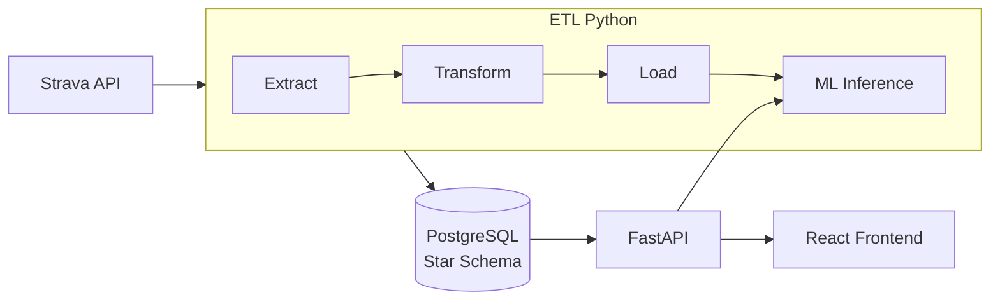
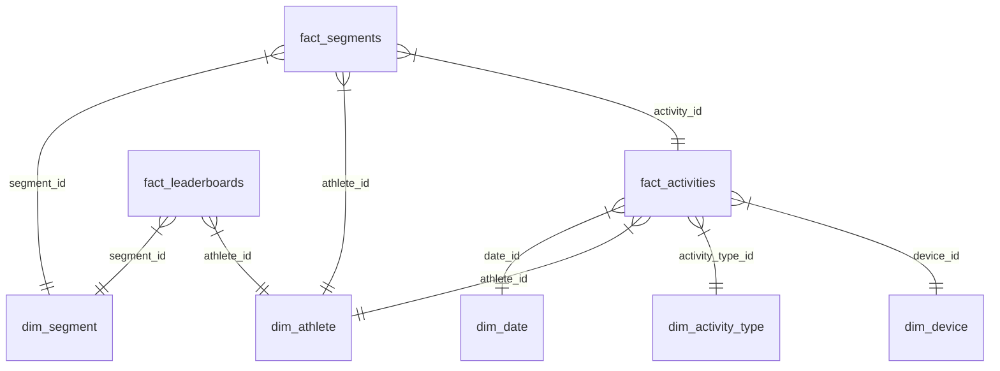
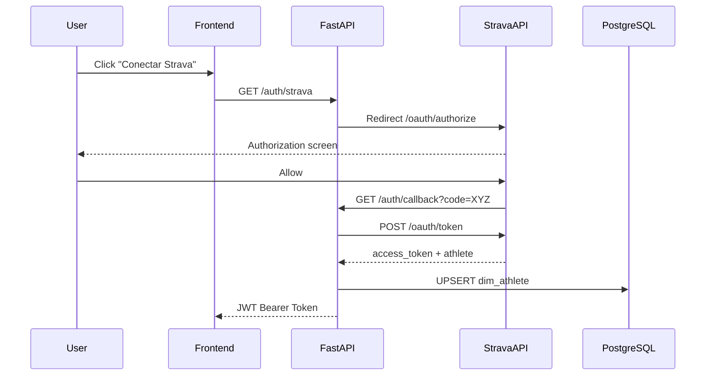
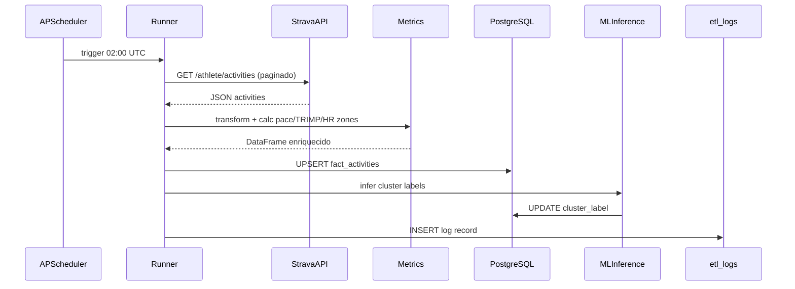

# Arquitetura do Sistema

## Diagrama de Fluxo

```mermaid
graph LR
  SA[Strava API] --> ETL
  subgraph ETL [ETL Python]
    E[Extract] --> T[Transform]
    T --> L[Load]
    L --> ML[ML Inference]
  end
  ETL --> PG[(PostgreSQL\nStar Schema)]
  PG --> API[FastAPI]
  API --> FE[React Frontend]
  API --> ML
```

## Star Schema

```mermaid
erDiagram
  fact_activities }|--|| dim_date : date_id
  fact_activities }|--|| dim_athlete : athlete_id
  fact_activities }|--|| dim_activity_type : activity_type_id
  fact_activities }|--|| dim_device : device_id
  fact_segments }|--|| dim_segment : segment_id
  fact_segments }|--|| dim_athlete : athlete_id
  fact_segments }|--|| fact_activities : activity_id
  fact_leaderboards }|--|| dim_segment : segment_id
  fact_leaderboards }|--|| dim_athlete : athlete_id
```

## OAuth Strava — Sequência

```mermaid
sequenceDiagram
  User->>Frontend: Click "Conectar Strava"
  Frontend->>FastAPI: GET /auth/strava
  FastAPI->>StravaAPI: Redirect /oauth/authorize
  StravaAPI-->>User: Authorization screen
  User->>StravaAPI: Allow
  StravaAPI->>FastAPI: GET /auth/callback?code=XYZ
  FastAPI->>StravaAPI: POST /oauth/token
  StravaAPI-->>FastAPI: access_token + athlete
  FastAPI->>PostgreSQL: UPSERT dim_athlete
  FastAPI-->>Frontend: JWT Bearer Token
```

## ETL — Sequência

```mermaid
sequenceDiagram
  APScheduler->>Runner: trigger 02:00 UTC
  Runner->>StravaAPI: GET /athlete/activities (paginado)
  StravaAPI-->>Runner: JSON activities
  Runner->>Metrics: transform + calc pace/TRIMP/HR zones
  Metrics-->>Runner: DataFrame enriquecido
  Runner->>PostgreSQL: UPSERT fact_activities
  Runner->>MLInference: infer cluster labels
  MLInference->>PostgreSQL: UPDATE cluster_label
  Runner->>etl_logs: INSERT log record
```
